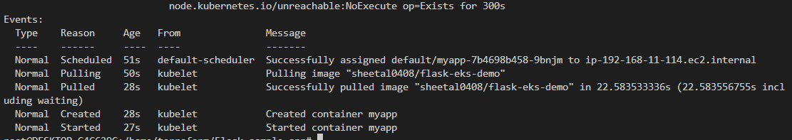

# Flask-sample-app

This readme file is intended to provide guidance on testing liveness, readiness, and startup probes in a Kubernetes environment.

## Prerequisites
Before you can begin testing, you will need the following:

- A Kubernetes cluster
- A deployment with liveness, readiness, and startup probes defined
- Access to the Kubernetes command-line tool (kubectl)

Here in this repository everything is included for your ease:

- to begin with cluster configuration
`eksctl create cluster -f clusterconfig.yaml`
- to create deployment
`kubectl create -f deployment.yaml`

## Testing Liveness probe
A liveness probe is used to check if a container is still running. To test the liveness probe, you can simulate a failure in the container that would trigger the probe. For example, you can intentionally crash the application.
Here for testing purpose I crashed the application by printing file that doesn't exist in container.

`kubectl apply -f deployment.yaml` 

After running the commands, wait for the liveness probe to kick in and check the status of the container using the `kubectl describe pod` command. You should see that the container has been restarted.

Test result fail as the file was not found in the container while executing command. 

## Testing Readiness probe
A readiness probe is used to check if a container is ready to start accepting traffic. To test the readiness probe, you can simulate a situation where the container is not ready.
Here I tried tcpSocket way to check the probe. I tried to open the wrong port for testing purpose.

`kubectl apply -f deployment.yaml` 

After running this command, wait for the readiness probe to kick in and check the status of the container using the `kubectl describe pod` command. You should see that the container is not ready and that the readiness probe is failing.

Here connection is refused as the probe was trying to open Socket on port 5000 where the container is exposed on port 4000.

## Testing Startup probe

A startup probe is used to check if a container has started successfully. To test the startup probe, you can simulate a situation where the container is taking too long to start up.
If the status code is between 200 - 399 the probe will be considered successful else failure.

After creating deployment you will find that the startup Probe failed 

Here connection is refused as the probe was trying to send Http Get request on port 5000 where the container is exposed on port 4000.

## Final Result of Deployment 

